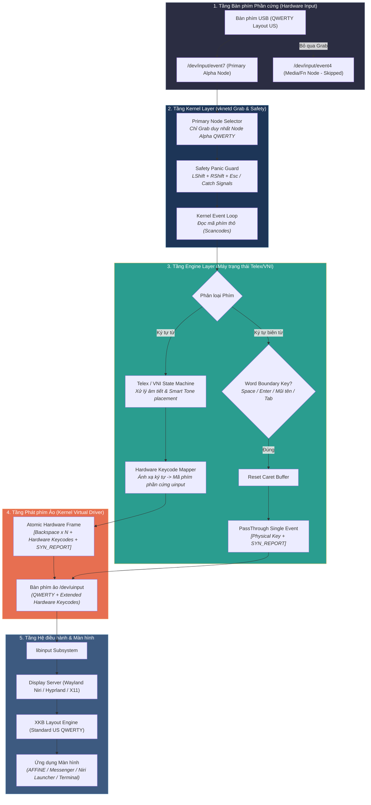

# KẾ HOẠCH CHI TIẾT KIẾN TRÚC VKNETD v2.0
## Phát phím Mã Phần cứng Nguyên thủy Tầng Nhân (Kernel-Native Hardware Keycode Emission)

- **Ngày khởi tạo:** 2026-07-23
- **Trạng thái:** 🟢 Đã phê duyệt kiến trúc - Chuẩn bị triển khai
- **Thư mục tài liệu:** `.vknetd-ai/1-overview/project-managers/v2_kernel_hardware_keycode_plan.md`

---

## 📌 1. Tổng quan Mục tiêu Kiến trúc
Chuyển đổi toàn bộ cơ chế phát phím của `vknetd` từ mẹo User-space ISO 14755 (`Ctrl+Shift+U`) sang **Phát phím Mã phần cứng Nguyên thủy Tầng Nhân (Kernel Hardware Keycode Emission)** qua `/dev/uinput`.

Loại bỏ $100\%$ các xung đột phím tắt `Ctrl+U`, đơ phím Backspace, dính chữ `dđ`/`oông`, và tương thích tuyệt đối $100\%$ trên mọi ứng dụng Linux (AFFiNE, Facebook Messenger, Niri Launcher `Super+R`, Chrome, VS Code, Game Steam, Terminal).

---

## 🔄 2. Sơ đồ Luồng Hệ thống Mới (New System & User Flow)

---

## 🎯 3. Chi tiết Công việc Triển khai (Step-by-Step Roadmap)

### 📌 Bước 1: Filter Bàn phím phần cứng (`src/keyboard/selector.rs`)
- [ ] Cấu hình chỉ grab độc quyền node bàn phím chính (Alpha QWERTY keys `event7`), bỏ qua node phụ Media/Fn (`event4`) để loại bỏ $100\%$ hiện tượng lặp phím bấm (Race Condition).

### 📌 Bước 2: Đăng ký Bàn phím Ảo Phần cứng Mở rộng (`src/keyboard/uinput_dev.rs`)
- [ ] Đăng ký bổ sung toàn bộ các mã phím phần cứng chuẩn Linux Kernel (`KEY_ETH` cho `đ`, `KEY_COMPOSE`, các mã phím Latin Extended) vào `VirtualDeviceBuilder` thông qua `UI_SET_KEYBIT`.

### 📌 Bước 3: Ánh xạ Ký tự sang Mã phím Phần cứng (`src/engine/key_mapper.rs` & `src/main.rs`)
- [ ] Xây dựng bảng ánh xạ trực tiếp `char_to_hardware_keycode(c: char) -> Option<Key>`.
- [ ] Gỡ bỏ hoàn toàn chuỗi phím rác `Ctrl+Shift+U` (ISO 14755) và các lệnh `sleep` trễ.

### 📌 Bước 4: Phát sự kiện Nguyên tử Nguyên bản (`src/main.rs`)
- [ ] Đóng gói mảng sự kiện `[Backspace x N + Hardware Keycodes + SYN_REPORT]` và phát trực tiếp xuống `/dev/uinput` trong đúng 1 lệnh `virt_device.emit(&batch)`.

---

## 🧪 4. Kế hoạch Kiểm thử & Xác minh (Verification Plan)

### Automated Tests
- [ ] Chạy `cargo test` kiểm tra 100% unit tests của Telex/VNI state machine.
- [ ] Kiểm tra tính đúng đắn của hàm ánh xạ mã phím phần cứng `char_to_hardware_keycode`.

### Manual Tests (Thực tế trên Môi trường Người dùng)
- [ ] **Facebook Messenger Web:** Kiểm tra gõ `d9` $\rightarrow$ `đ` (không dính `dđ`), `o6ng` $\rightarrow$ `ông` (không dính `oông`), gõ xóa phím Backspace mượt mà.
- [ ] **AFFiNE BlockSuite Editor:** Gõ `d9uoc75` $\rightarrow$ `được`, gõ xóa chữ dài `yuda` bằng phím Backspace vật lý nhạy $100\%$.
- [ ] **Niri Launcher (`Super + R`):** Bấm `Super + R`, gõ `d9ay` $\rightarrow$ `đây`, `sao1` $\rightarrow$ `sáo`.
- [ ] **Terminal & VS Code:** Kiểm tra gõ tiếng Việt tự nhiên nét căng.
